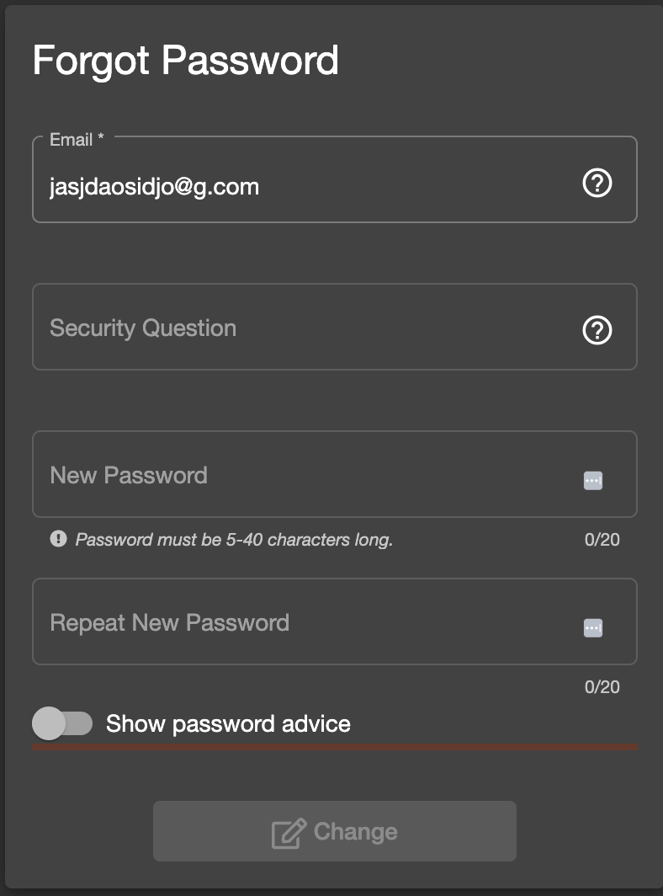

### Exploratory Testing Session - owasp juice app (https://juice-shop.herokuapp.com/#/search)
### Environment - MacOS/Chrome: 132
#### For this exploratory session I decided to separate the points into areas of the application, since I was not aware of the app prior to this assignment, this was a natural flow to me, and it was a way to organize my findings.

- On the Forgot Password area:
    - Users are not able to select a recovery question **(Risk: Medium - High)**
    - Password fields are also disabled on this view, is this expected?

    Repro Steps:
    1. From the Login Page, click on `Forgot your password?`
    2. Attempt to fill the form.
    3. Notice you can change the security question.
    

- On the Create Account Area:
    - The progress bar for the level of security of the password stays active even before starting to fill the form, which can be confusing, the way it currently is it can appear to be an issue. **(Risk: Low)**
- On the Login Area:
    - User can attempt to login with an invalid email format (any string, including a string made completely out of empty space) **(Risk:Medium)**
    Repro Steps:
    1. Go to the login page
    2. Submit an login attempt with an invalid string that doesn't have the shape of an email
    3. Notice the request be fired even though the data is invalid.
    
- On the Main Page: 
     - The Success Toasts are sometimes triggered even if the user didn't perform the expected action, for example, I received the “You successfully solved a challenge: DOM XSS (Perform a DOM XSS attack with <iframe src="javascript:alert(`xss`)">.)” even though I did nothing to trigger that message. **(Risk: Low)**

- With the User logged in:
     - `Request Recycling Box` offers no user warning telling the operation cannot be executed if there are no saved addresses on the account. **(Risk: Low)**
        - The form cannot be submitted and no information is provided on the “why” that's happening.
        

    - On the recycle area of the site:
     - It's possible to submit the form even with invalid values on the quantity of liters. We change the class on the submit button element and continue to submit the request. No error is thrown on the backend.
     - We can also submit the Recycle request using a Pick up Date that is in the past.

- For downloading the user data:
     - Data can be downloaded before completing the captcha. **(Risk: Low - Medium)**
     Repro Steps:
     1. Enter the Download your data area
     2. Attempt to download the data before completing the captcha
     3. Notice that you are able to complete the operation

- On the purchase flow:
    - After completing a purchase on the site, my test users were not able to attempt another one. The items were not being added correctly to the cart, as it would be expected. **(Risk: High)**
        Repro Steps:
        1. With an user, complete one purchase;
        2. Attempt to do another purchas by adding items to your basket;
        3. Notice that your items are not being added to the basket as it would be expected.
    
    - After adding items to the basket, visiting it, and reloading the page, when the reload finishes the number on the basket icon will be zero, even though you have items in it. **(Risk: Medium - High)**
      - Once you start adding items again, the number will continue to be populated once more.

- On the Address form:
    - For address form, when entering the values on the fields other than the mobile phone, users can simply add empty spaces instead of actually entering a space-only string. **(Risk: Medium)**
    - No verification for the data inserted in this form. Invalid data such as space strings are allowed.

