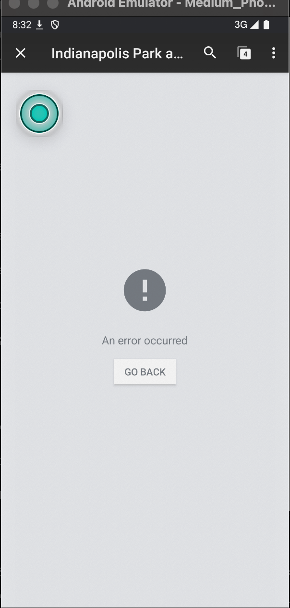
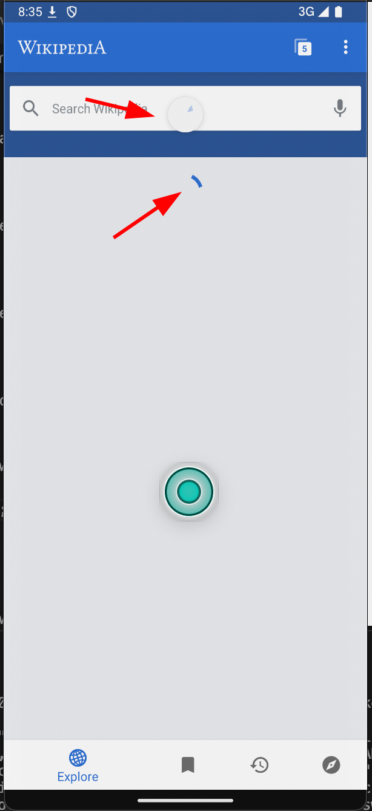

### Exploratory Testing Session - WikiApp 
### Environment - Android Emulator - API 35

 1. When clicking on search results, sometimes we are met with an `An Error Occurred` page even though our search clearly had results previously. **(Risk: High)**
    Repro Steps:
    1. Access an article;
    2. Notice that it doesn't open and an error view is displayed
    
    
 
 2. Clicking on articles suggested on the main page will also take the user to `An Error Occurred` page. **(Risk: High)**
    - Same as the error above, and the repro steps are also similar. Clicking or interacting with any article is currently generating errors.
 
 3. Clicking on share buttons will cause the app to close with no warning. **(Risk: High)** **(Happening intermittently)**
    Repro Steps:
    1. Attempt to share an article from a card.
    2. Notice that the app crashes instead of allowing the share to happen.
 
 4. Scrolling Up will cause two spinners to appear; **(Risk: Low - Medium)**
    Repro Steps:
    1. On the main view of the app, drag the down
    2. Notice that two spinners appear on the screen, while we should only see one.
 
 5. The animation on the reloading spinners appear to be glitchy, and they will overlap with each other, which doesn't seem to be the expected behavior; **(Risk: Low - Medium)**
    Repro Steps:
    1. Same as step 4.
        

 6. Once an item is hidden, and the `undo` button is not immediately used, there's no way to go back and re-display a content. **(Risk: Medium)**
    Repro Steps:
    1. Hide all the items of your timeline;
    2. Notice that now all the items are hidden as expected, but theres also no way to read anything on the app unless the search bar is used.
    3. Even if you close and open again the app, no other content will be displayed to the user	
